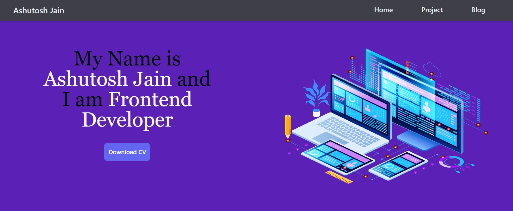

# Personal Portfolio

This project develop in the react JS with tailwind CSS and this project is responsive.This project define the description about project with there live links.

## Deployment

To deploy this project Download the code from my repository and excecue the npm start command 

## Features

1.Website was fully responsive 
2.User can get the Project repo link and get the access of live Project
3.User can read the HTML CSS blogs.
## Contribution

Any feature requests and pull requests are welcome!

